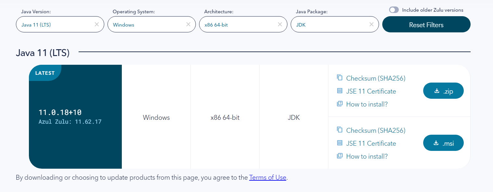

# 개발 환경 Version 확정

**<버전확인>**

- node.js ⇒  ******~~18.13.0 LTS (openvidu - React 사용하다가 not support에러 발생)~~ → ***v16.13.0***
    - node.js 버전 바꾸는 법 → NVM 사용
- java ⇒ 11 (Oracle JDK vs Azul Zulu vs Amazon Corretto) **Zulu 확정!**
    
    - 버전 번호 : 11.0.18+10 /  Azul Zulu: 11.62.17
        
        
        
- Spring boot ⇒ 2.7.8
    - 최소 버전 : 2.5.0 (gradle 지원)
    - mysql jdbc에 대한 변경이 있었음
        
        [Release v2.7.8 · spring-projects/spring-boot](https://github.com/spring-projects/spring-boot/releases/tag/v2.7.8)
        
    - application.properties로 하기(기본으로 만들어주기도 함)
- MySQL ⇒ MySQL 8.0.32
    - spring boot 에서 mysql 지원을 8.0.32 로 최초 확대해서 선택
- Gradle vs Maven ⇒ Gradle
    - 빌드 속도에서 유리 → CI/CD 할 예정이기 때문에 선택
- OpenVidu ⇒ 2.25.0
- nginx ⇒ 1.22.1
- React ⇒ 18
- Redux, Redux-thunk ⇒ 최신버전 redux : 4.2.0
- fullcalendar ⇒ 최신버전 6.0.3
- apexchart ⇒ 최신버전 3.36.3
- daisyUI ⇒ 최신버전
- tensorflow
    
    ```jsx
    "@tensorflow-models/posenet": "^2.2.2",
    "@tensorflow/tfjs": "^4.2.0",
    "@tensorflow/tfjs-backend-cpu": "^3.21.0",
    "@tensorflow/tfjs-core": "^3.21.0",
    "@tensorflow/tfjs-node": "^4.2.0",
    ```
