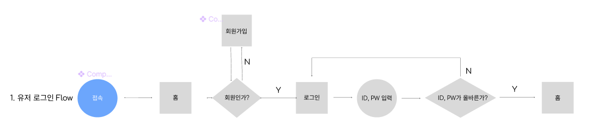

# UserFlow

## Info
- 사용자의 사용 시나리오를 정의하고, 어떤 화면 및 동작을 진행할 것인지 흐름을 도식화 한 그림

## Actor : User

### Case 1 : Login

### Case 2 : Regist Course(Lecture)

### Case 3 : Take a Lecture

### Case 4 : Add Comment

## Actor : Teacher